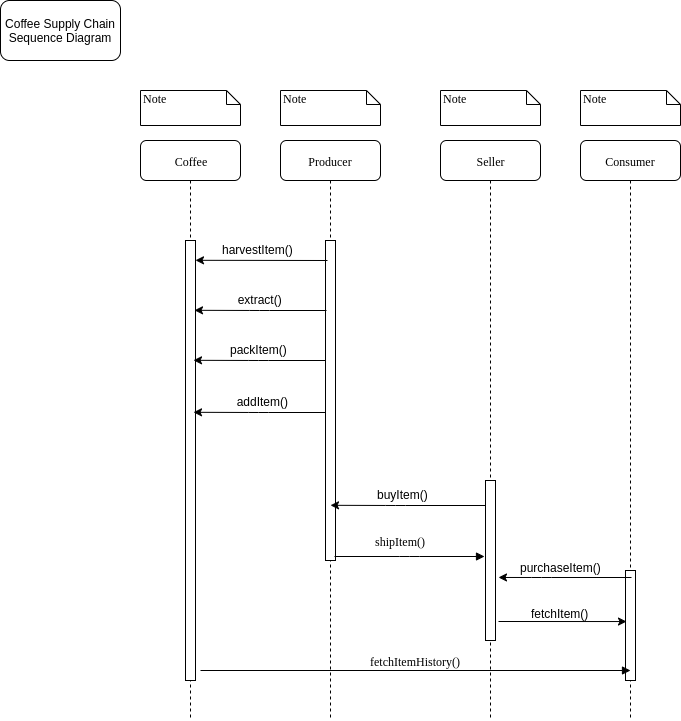
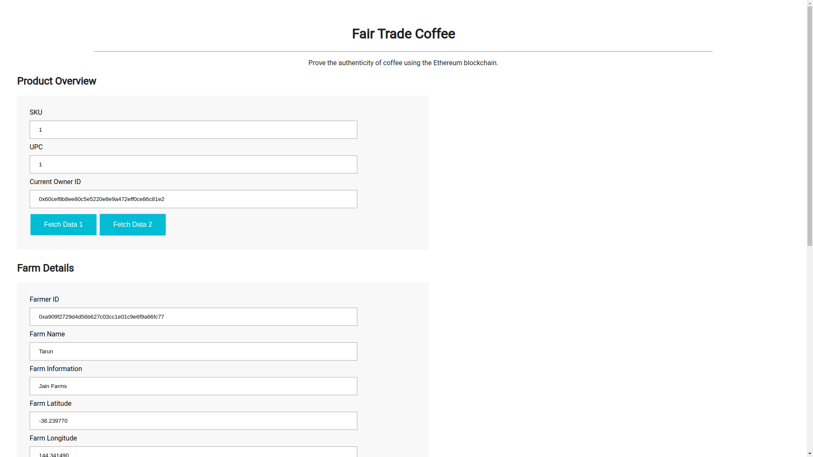
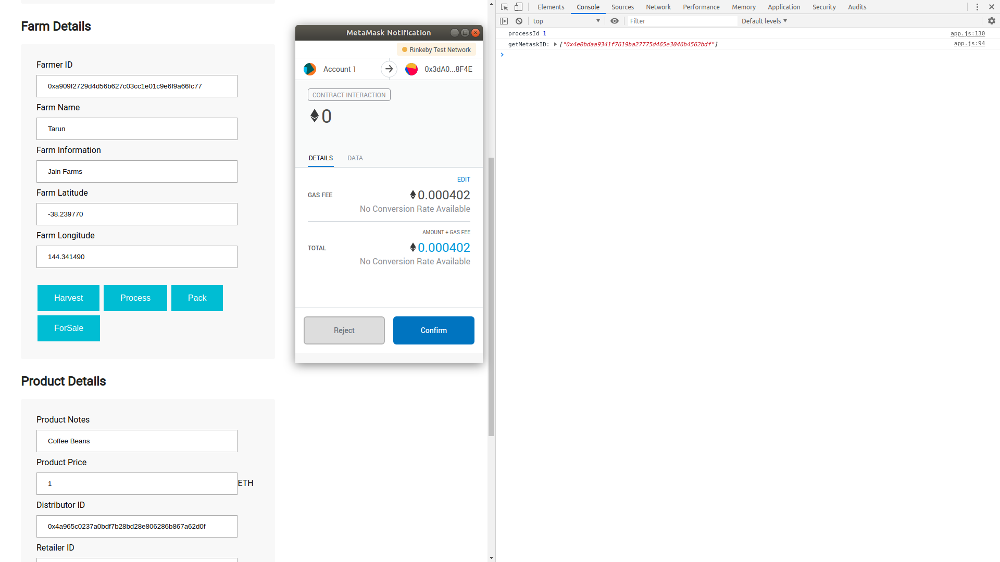
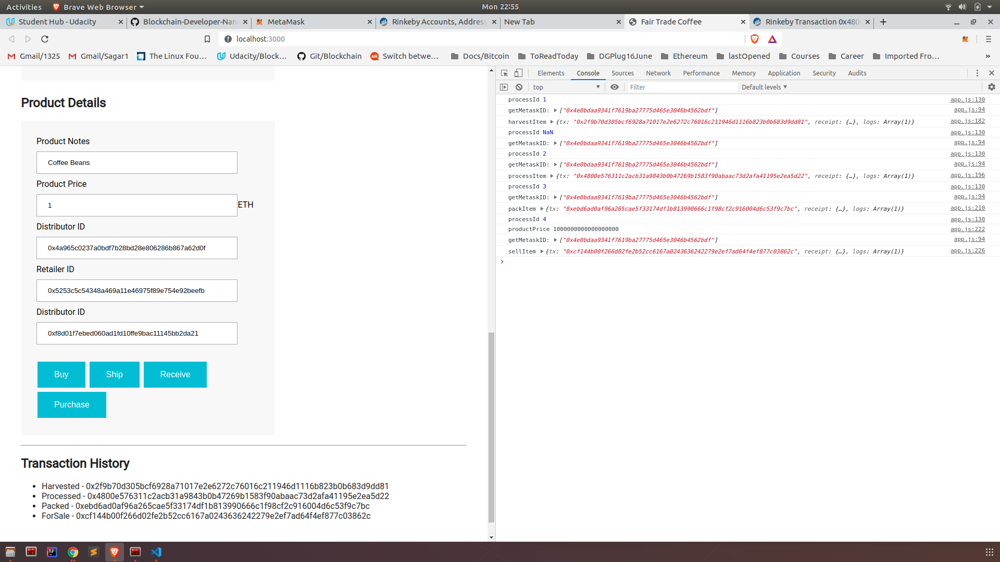
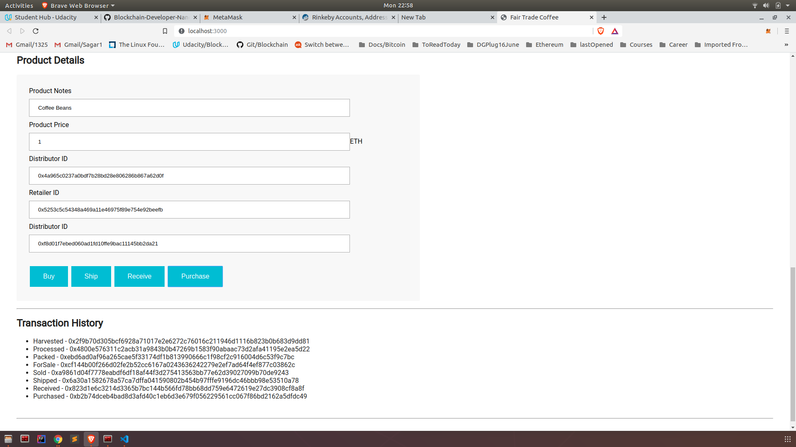

# Project6B
Architect a Blockchain Supply Chain Solution - Part B

## Getting Started
These instructions will install requirements and allow you to execute the code.

### Prerequisites
Node
NPM
Yarn

### Configuring your project

- Install requirements (within Project_6B folder)
>> yarn

You also need ganache-cli and truffle
>> yarn add ganache-cli
>> yarn add truffle@4

- To test the contract start 
>> yarn ganache-cli
>> yarn truffle test test/TestSupplychain.js

All tests should pass.

### Output For Test:

```
yarn truffle test test/TestSupplychain.js 
yarn run v1.19.1
$ /home/tarun/courses/blockchainudacity/project-6/Project_6B/node_modules/.bin/truffle test test/TestSupplychain.js
You can improve web3's peformance when running Node.js versions older than 10.5.0 by installing the (deprecated) scrypt package in your project
Compiling ./contracts/Migrations.sol...
Compiling ./contracts/coffeeaccesscontrol/ConsumerRole.sol...
Compiling ./contracts/coffeeaccesscontrol/DistributorRole.sol...
Compiling ./contracts/coffeeaccesscontrol/FarmerRole.sol...
Compiling ./contracts/coffeeaccesscontrol/RetailerRole.sol...
Compiling ./contracts/coffeeaccesscontrol/Roles.sol...
Compiling ./contracts/coffeebase/SupplyChain.sol...
Compiling ./contracts/coffeecore/Ownable.sol...

ganache-cli accounts used here...
Contract Owner: accounts[0]  0x2c04f1abae267af056b1254361acaf9ed54c97f8
Farmer: accounts[1]  0xcc0b391336d7be5bb5457a13a676351ab7c39039
Distributor: accounts[2]  0x5034d3b952b44deb35b2a5b08b3754592039d74e
Retailer: accounts[3]  0x4341f1185a1346f27413a1af9a20d1df4ce23b73
Consumer: accounts[4]  0xb515e062e6482d59421c6c1ed09cd5ed9199b747


  Contract: SupplyChain
    ✓ Testing smart contract function harvestItem() that allows a farmer to harvest coffee (135ms)
    ✓ Testing smart contract function processItem() that allows a farmer to process coffee (146ms)
    ✓ Testing smart contract function packItem() that allows a farmer to pack coffee (71ms)
    ✓ Testing smart contract function sellItem() that allows a farmer to sell coffee (73ms)
    ✓ Testing smart contract function buyItem() that allows a distributor to buy coffee (74ms)
    ✓ Testing smart contract function shipItem() that allows a distributor to ship coffee (80ms)
    ✓ Testing smart contract function receiveItem() that allows a retailer to mark coffee received (112ms)
    ✓ Testing smart contract function purchaseItem() that allows a consumer to purchase coffee (77ms)
    ✓ Testing smart contract function fetchItemBufferOne() that allows anyone to fetch item details from blockchain
    ✓ Testing smart contract function fetchItemBufferTwo() that allows anyone to fetch item details from blockchain


  10 passing (847ms)

Done in 6.63s.
```

- Install Metamask plugin for brave / chrome /firefox
- Metascan must be connected to your wallet. Your need to add ether to your wallet from a faucet https://faucet.rinkeby.io/.
- When your web app interacts with your wallet, Metascan will ask for confirmation.
- To start the application issue the command  ```yarn dev```. The UI will look like below:

## Contract deployment
```
>> yarn truffle migrate --network rinkeby --reset --compile-all

yarn truffle migrate --network rinkeby --reset --compile-all
yarn run v1.19.1
$ /home/tarun/courses/blockchainudacity/project-6/Project_6B/node_modules/.bin/truffle migrate --network rinkeby --reset --compile-all
You can improve web3's peformance when running Node.js versions older than 10.5.0 by installing the (deprecated) scrypt package in your project
Compiling ./contracts/Migrations.sol...
Compiling ./contracts/coffeeaccesscontrol/ConsumerRole.sol...
Compiling ./contracts/coffeeaccesscontrol/DistributorRole.sol...
Compiling ./contracts/coffeeaccesscontrol/FarmerRole.sol...
Compiling ./contracts/coffeeaccesscontrol/RetailerRole.sol...
Compiling ./contracts/coffeeaccesscontrol/Roles.sol...
Compiling ./contracts/coffeebase/SupplyChain.sol...
Compiling ./contracts/coffeecore/Ownable.sol...

Writing artifacts to ./build/contracts

Using network 'rinkeby'.

Running migration: 1_initial_migration.js
  Deploying Migrations...
  ... 0x56fac4de99335f93f2e8356e84b592839199bf2f974fd37f56d00862c56101d9
  Migrations: 0xba53682129da47b5a1e5b36924d9a9e65ea917fe
Saving successful migration to network...
  ... 0xda196456afa01e63b0cd996db86b1ded12d8fd9fabc34a6daf5cdbb0e0bab863
Saving artifacts...
Running migration: 2_deploy_contracts.js
  Deploying FarmerRole...
  ... 0x919201780696686e2f23cf47104d8930aab956006b35166d3e7533beea716fe4
  FarmerRole: 0x7af3036f960f2d22bc4116e3b1d0a210e27715ca
  Deploying DistributorRole...
  ... 0x31928f4f746de093c6c98cdd8e2c864a64a14ebb7a25a6d77c668922ea87f2d3
  DistributorRole: 0x393df27a9f97c830fb90b1090778897e5d45ca68
  Deploying RetailerRole...
  ... 0xad6da7b239b3ff34dbed6ed5175e0ba2eea6fcfc2cc30c9d36535284c2fdc270
  RetailerRole: 0xc28cfe434568349ea69f82859b728a60c2948e81
  Deploying ConsumerRole...
  ... 0x7bd54aacd82159c74cc5ce0c1bc99f0de98f189f6c662b5c37e5ae52a621991a
  ConsumerRole: 0x15e986d6d6ec3911ef30e4a5fba9ca2f7c311a15
  Deploying SupplyChain...
  ... 0xff41c0bceba4d82006a8a80b092277ea31f438002f91de908378e19a0cad196c
  SupplyChain: 0xc652fe16d923d9d2188a948e164d49cafbd74b87
Saving successful migration to network...
  ... 0x8ba0aadd9b947a550243e6d385a37103e0717f7de4c3ea2cfe1c5f2c72e02d11
Saving artifacts...
Done in 140.54s.

```

## View details on Etherscan
### Contract address 
https://rinkeby.etherscan.io/address/0xba53682129da47b5a1e5b36924d9a9e65ea917fe

### Transaction History
Transaction History
Harvested - 0x0afe728c75e7e02ce8cdeac60d188534360351ebbfc5c33e23cee9a33d6a1339
Processed - 0x8d1ac5115e86106d0165e25528dd8400643ea3a7f6454a1ceb0a348e28711d3f
Packed - 0x0b2d199147a218633c15d50f341de39ee0a8bedaeaa628d6340d02814294d4e4
ForSale - 0x519858ae54cb927fab36fc1454d12a6c0f5e755664fc7e16b171f9d8edc57f35
Sold - 0x88e3be94487eecabadcc61c69823a6df5fed6436a955ea0bfc98cbf913a094e6
Shipped - 0x5cf5f8d4af44ac3175c507833054eb2e9edd5f89c15009995e406c2fc3d45f7e
Received - 0x4c6a4019472a767817461b1c8a0a8229f9060292574267b8dfa3dec26852a6ee
Purchased - 0xced6c985564032865a5f60b1e3b04e3db0171f920fb5d943bb85b3ef0faa3d01

## UML Diagrams

### Activity Diagram


### Sequence Diagram


### State Diagram


### Class Diagram (Data model)
_diagram_udacity_p6a.png)


### Screenshots



